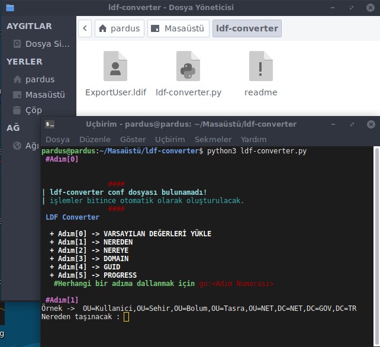

# LDIF File Converter

**Versiyon	:**  1.0
**Lisans  	:**  GPL
**Contributors  :**  Burak Büyükyüksel
   

## Nedir?

Windows AD'ninden dışarı aktarılmış kullanıcıları, OpenLDAP içeri aktarımını kolaylaştıran script.

## İmkan Sağlar;

*	LDAP'tan dışarı aktarılmış kullanıcıların, kolaylıkla OpenLDAP uyum sağlayabilmesi
*	Adımlar arasında rahatlıkla ilerleyebilme
*	İşlemler sonucu ayarları kaydedip, tekrar okuyabilme

## Changelog

### 1.0
* Released : September 18, 2018

Initial release